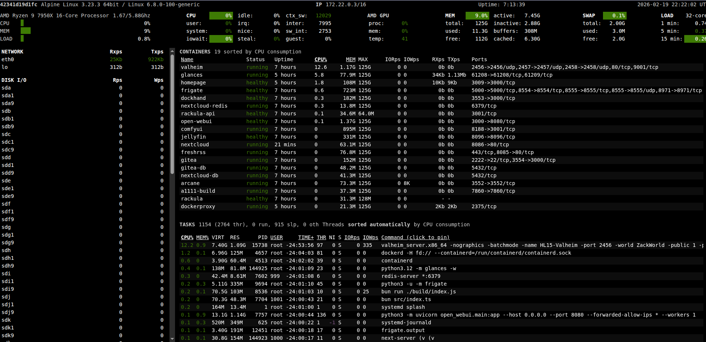

# Homepage

## YouTube Video
- [Homepage](https://www.youtube.com/watch?v=7hc7mjitgIQ)

## What this page contains
Notes and example files used in the **Homepage** video.

## Notes
This has some added configurations that may not be needed depending on your set up. I'll be including all items from the video. I'll add comments to optional sections

## Homepage Setup Walkthrough

**1) File Structure**

In my set up I have all my containers living in `/home/zack/docker/<container_name>` yours may differ


```bash
zack@hl15-beast:~/docker/homepage$ ls -al
total 20
drwxrwxr-x 3 zack zack 4096 Feb 19 13:09 .
drwxrwxr-x 7 zack zack 4096 Feb 17 14:46 ..
drwxrwxr-x 6 zack zack 4096 Jan 30 10:35 config
-rw-rw-r-- 1 zack zack 1345 Feb 19 13:09 docker-compose.yaml
-rw-rw-r-- 1 zack zack  754 Feb 19 13:06 .env
```
The first file we'll tackle is our .env because our docker-compose.yaml and inturn what's in our config will reference it's contents
.env is optional but makes things easier when you want to have a central location to reference credentials, users etc

```bash
# user mapping
PUID=1000
PGID=1000

# -----------------------------
# Homepage variable substitution
# (used in config/*.yaml as {{HOMEPAGE_VAR_*}})
# -----------------------------

# Glances / Uptime Kuma host
HOMEPAGE_VAR_MONITOR_HOST=10.20.0.61

# Portainer
HOMEPAGE_VAR_PORTAINER_URL=https://10.20.0.61:9443
HOMEPAGE_VAR_PORTAINER_ENV=3
HOMEPAGE_VAR_PORTAINER_KEY=<KEY>

# Proxmox cluster (shared creds)
HOMEPAGE_VAR_PROXMOX_USER=api@pam!homepage
HOMEPAGE_VAR_PROXMOX_SECRET=030a2e73-6b9b-470d-bf09-ffebc16ee084

# Proxmox node URLs
HOMEPAGE_VAR_PROXMOX_PVE1_URL=https://192.168.105.15:8006
HOMEPAGE_VAR_PROXMOX_PVE2_URL=https://192.168.105.16:8006
HOMEPAGE_VAR_PROXMOX_PVE3_URL=https://192.168.105.17:8006
```


Next is our docker-compose.yaml below are the needed components all other are optional
- The first necessary parts are the first 4 lines(5 is you're using a .env)
- If you plan on using auto-discover as mentioned in the video you'll want to add the DOCKER_HOST section as well as the docker proxy section further down
- Setting your ports will be needed 3009:3000 in my example, I specified 3009 because I access grafana via 3000. The 3000 on the right is for inside the container so that is fine to be doubled up.
- volumes: ./config:/app/config is needed to have your homepage persistent across changes when recreating the container
- The rest of the volumes section is optional, the second and third are for icons and images.
- The restart section isn't required but reccomended so it comes back after reboots
- Lastly the Glances section is completely optional it's just an extra container deployed to get system resources



```yaml
services:
  homepage:
    image: ghcr.io/gethomepage/homepage:latest
    container_name: homepage

    env_file:
      - ./.env

    environment:
      HOMEPAGE_ALLOWED_HOSTS: 10.20.0.61:3009,10.20.0.61,hl15-beast:3009,hl15-beast,localhost:3009
      PUID: 1000
      PGID: 1000

      # Use dockerproxy (no raw docker.sock in this container)
      DOCKER_HOST: http://dockerproxy:2375

    ports:
      - 3009:3000

    volumes:
      - ./config:/app/config
      - ./config/icons:/app/public/icons:ro
      - ./config/images:/app/public/images:ro

    restart: unless-stopped

  dockerproxy:
    image: tecnativa/docker-socket-proxy:latest
    container_name: dockerproxy
    restart: unless-stopped
    environment:
      CONTAINERS: 1
      INFO: 1
      IMAGES: 1
      NETWORKS: 1
      SERVICES: 1
      TASKS: 1
      EVENTS: 1
      VOLUMES: 1
      SYSTEM: 1
      VERSION: 1
    volumes:
      - /var/run/docker.sock:/var/run/docker.sock:ro

  glances:
    image: nicolargo/glances:latest
    container_name: glances
    restart: unless-stopped
    pid: host
    ports:
      - "61208:61208"
    environment:
      - GLANCES_OPT=-w
    volumes:
      - /var/run/docker.sock:/var/run/docker.sock:ro

```
Now our 3 files that bring everything together services.yaml, settings,yaml and widgets.yaml


**services.yaml**
```yaml
TO_BE_ADDED
```

**settings.yaml**
```yaml
TO_BE_ADDED
```


**widgets.yaml**
```yaml
TO_BE_ADDED
```